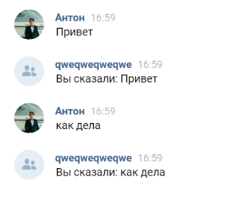

# VKBot

Простой бот для вк, который должен копировать сообщение пользователя
и отправлять ему обратно в формате "Вы сказали: " + сообщение пользователя.



# Запуск

## Перед запуском

Для начала надо создать сообщество в ВК. Внутри сообщества надо перейти в **Управление->Работа с API**

На вкладке ключи доступа надо получить ключ доступа приложения.

**Создать ключ -> выбрать нужные права -> создать**

## VKTunnel

Для запуска на локальной машине может понадобиться подъем локального веб-сервера.
Можно использовать ngrok или VSCODE. Я выбрал VK Tunnel.
https://dev.vk.com/ru/libraries/tunnel

```bash
yarn global add @vkontakte/vk-tunnel
```

ИЛИ

```bash
npm install @vkontakte/vk-tunnel -g
```

После установки, можно изменить порт при желании на тот, который занимает приложение с ботом.

```bash
vk-tunnel --insecure=1 --http-protocol=http --ws-protocol=ws --host=localhost --port=5173 --timeout=5000
```

### Callback API

Далее надо перейти на вкладку Callback API в управлении сообществом и вставить адрес, который передал VKTunnel в поле "
адрес".

## Запуск приложения

Перед непосредственным запуском надо установить ключи в application.yml (src/main/resources/application.yml).
Также обязательно сменить порт на тот, что указан в VKTunnel

```yml
spring:
  application:
    name: VKBot

vk:
  api:
    key: ваш_ключ_приложения
  callback:
    api:
      secret: ваш_ключ_callbackapi
      confirm: ваш_код_подтверждения_callbackapi
server:
  port: 5173
```

Для запуска использовалась OpenJDK 23.
Для начала надо собрать jar

```bash
mvn clean install -f pom.xml
```

Далее можно запустить jar

```bash
java -jar .\target\VKBot-0.0.1-SNAPSHOT.jar
```

# Возможности

Приложение может получать запрос от вк на подтверждение работы сервера и управлять ботом.

Управление ботом осуществляется за счет получение запроса от пользователя, создания ответа и отправки ответа
пользователю.